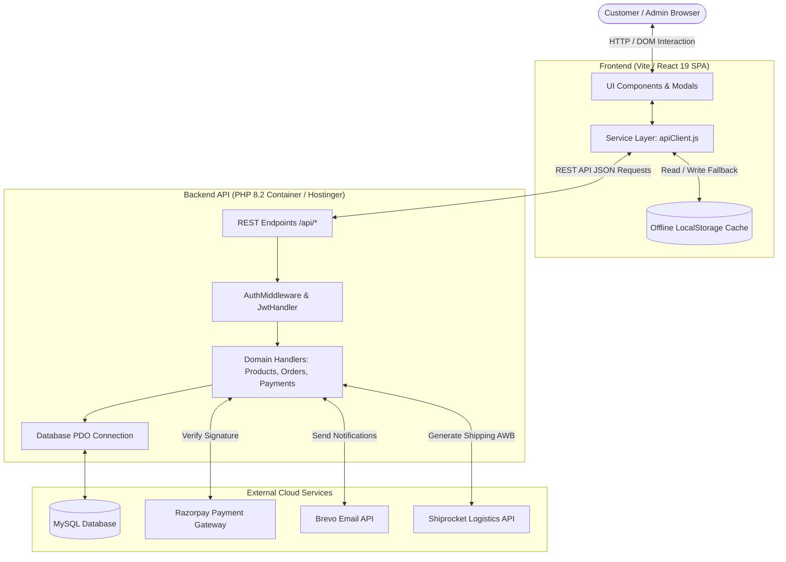

# Vishwakarma Bat House (VK Bat House) - Luxury Sports E-Commerce Platform

[](https://react.dev/)
[](https://vitejs.dev/)
[](https://www.php.net/)
[](https://www.mysql.com/)
[](LICENSE)

---

## 1. Project Overview

**Vishwakarma Bat House** is a full-stack, direct-to-consumer (D2C) luxury cricket equipment e-commerce platform. It solves the friction of purchasing high-end handcrafted cricket bats online by providing interactive blade specifications (weight, handle shape, grain density), real-time GST invoicing, integrated Razorpay payments, automated order tracking, and an offline-resilient storefront paired with a unified admin control panel.

---

## 2. Features

### 🏏 Storefront & Customer Experience
- **Interactive Bat Customizer**: Dynamic selection of bat clefts, weight brackets (1160g–1240g), and handle profiles (round, oval, semi-oval).
- **Product Detail Modal & Media Showcase**: High-resolution image zoom, embedded bat ping demo videos, customer review ratings, and helpfulness voting.
- **Smart Catalog Filtering & Search**: Instant real-time search across willow grades, price points, blade types, and popularity metrics.
- **Cart & Wishlist Drawers**: Persistent cart management with instant drawer previews and one-click wishlist syncing.
- **Razorpay Checkout & Instant PDF Invoicing**: Test and production payment gateway integration with downloadable GST tax invoices.
- **Customer Portal**: User authentication (JWT session management), address book, active order live timeline tracking, and order cancellation.

### 🛡️ Admin Management Console
- **Role-Based Access Control (RBAC)**: Distinct permissions for `super-admin`, `staff`, `content-manager`, and `sales-team`.
- **Catalog & Inventory Control**: Multi-image batch uploads with automatic client-side canvas compression, stock status toggles, and category managers.
- **Order Fulfillment Workflow**: Status updates (`pending` → `confirmed` → `processing` → `shipped` → `delivered` → `cancelled`) with Shiprocket AWB tracking hooks and CSV bulk export.
- **Visual CMS & Storytelling**: Dynamic homepage block reordering, banner sliders, FAQ builder, customer testimonials, and craftsmanship timeline editor.
- **Database Backup & Audit Logging**: One-click JSON database snapshot backup/restore and real-time administrator activity logs.

---

## 3. Tech Stack

| Layer | Technology | Role & Rationale |
|---|---|---|
| **Frontend Framework** | React 19 + Vite | Component modularity, sub-second HMR development, and optimized roll-up production bundling. |
| **Styling & Animation** | Vanilla CSS + Framer Motion | Bespoke luxury dark/gold aesthetic, zero framework CSS bloat, and smooth spring physics animations. |
| **Carousel & Sliders** | Swiper.js | Touch-responsive, infinite loop product showcase with responsive breakpoints. |
| **Backend REST API** | PHP 8.2 (Vanilla OOP) | Fast, lightweight serverless/container deployment without heavy framework overhead. |
| **Database** | MySQL / MariaDB | Relational ACID compliance for orders, transactions, inventory counts, and customer accounts. |
| **Authentication** | JWT (HMAC-SHA256) | Stateless session tokens passed via standard Authorization Bearer headers. |
| **Payments** | Razorpay SDK | Secure UPI, NetBanking, and Card checkouts with server-side HMAC-SHA256 signature verification. |
| **Transactional Email** | Brevo (Sendinblue) API | Automated welcome emails, order confirmations, and password reset flows. |
| **Logistics** | Shiprocket API | Automated shipping rate estimation and airway bill (AWB) tracking numbers. |

---

## 4. Architecture



---

## 5. Project Structure

```text
sports/
├── api/                             # Backend PHP REST API
│   ├── auth/                        # User registration, login, token verification
│   ├── categories/                  # Category CRUD endpoints
│   ├── config/                      # Database PDO, JWT, AuthMiddleware, ErrorHandler
│   ├── orders/                      # Order placement, status updates, list orders
│   ├── payments/                    # Razorpay order generation & signature verify
│   ├── products/                    # Product catalog CRUD, search & filtering
│   ├── settings/                    # CMS settings, banners, navigation, typography
│   ├── upload/                      # Image upload & validation handlers
│   ├── setup_admin.php              # CLI admin account generator
│   └── sync.php                     # Cloud state JSON sync endpoint
│
├── assets/uploads/                  # Uploaded product media (secured by .htaccess)
│
├── database/                        # Database Schemas & Migrations
│   ├── schema.sql                   # Main active database schema
│   ├── mock_data.sql                # Seed / test bat inventory data
│   └── update_schema.sql            # Schema migration and update log
│
├── public/                          # Static public web assets
│   ├── assets/                      # Intro video, brand assets, default bat imagery
│   └── .htaccess                    # Apache routing rules & gzip compression
│
├── src/                             # React 19 Frontend Source Code
│   ├── components/                  # Storefront & Admin UI Components
│   │   ├── admin/                   # Admin Console (AdminDashboard.jsx - Lazy Loaded)
│   │   ├── AuthModal.jsx            # Customer login & register modal
│   │   ├── BestSellersCarousel.jsx  # Swiper-powered autoplay bat carousel
│   │   ├── CartModal.jsx            # Flyout shopping cart drawer
│   │   ├── CheckoutView.jsx         # Multi-step checkout & payment processing
│   │   ├── CustomerProfile.jsx      # Customer portal & order history
│   │   ├── ProductDetailModal.jsx   # Product specs, variants & reviews
│   │   ├── ProductList.jsx          # Filterable catalog with search & sorting
│   │   ├── Timeline.jsx             # Willow craftsmanship story timeline
│   │   └── WishlistModal.jsx        # Saved wishlist items drawer
│   ├── data/                        # Local DB & offline fallback storage (db.js)
│   ├── services/                    # API client and service layer (apiClient.js, etc.)
│   ├── App.css / index.css          # Design tokens, themes & luxury styling
│   ├── App.jsx                      # SPA routing, theme handling & state
│   └── main.jsx                     # Vite React entrypoint
│
├── Dockerfile                       # Production Docker container definition for Render
├── eslint.config.js                 # Strict React 19 ESLint configuration
├── vercel.json                      # Vercel SPA rewrite routing rules
└── vite.config.js                   # Rollup vendor chunk splitting & proxy config
```

---

## 6. Installation & Setup

### Prerequisites
- **Node.js**: v18.0+ or v20.0+
- **PHP**: v8.1+ with `pdo_mysql`, `openssl`, and `gd` or `imagick` extensions enabled
- **MySQL / MariaDB**: v8.0+
- **Composer** (Optional) / Docker (Optional)

---

### Step 1: Clone Repository
```bash
git clone https://github.com/vishwakarmabat-git/Vishwakarma.git
cd Vishwakarma
```

### Step 2: Configure Environment Variables

Create `.env` in the root folder for Vite frontend:
```env
VITE_API_URL=/api
VITE_RAZORPAY_KEY_ID=rzp_test_YourTestKeyIdHere
```

Create `api/config/.env` for PHP backend:
```env
DB_HOST=localhost
DB_NAME=vk_sports
DB_USER=root
DB_PASSWORD=your_mysql_password
JWT_SECRET=your_super_secret_random_32_character_string_here
ADMIN_SYNC_TOKEN=your_custom_admin_sync_token
RAZORPAY_KEY_ID=rzp_test_YourTestKeyIdHere
RAZORPAY_KEY_SECRET=your_razorpay_secret_key_here
BREVO_API_KEY=your_brevo_smtp_api_key_here
SHIPROCKET_EMAIL=your_shiprocket_account_email
SHIPROCKET_PASSWORD=your_shiprocket_account_password
```

### Step 3: Database Setup
Import the SQL schemas into your MySQL database:
```bash
mysql -u root -p vk_sports < database/schema.sql
mysql -u root -p vk_sports < database/mock_data.sql
```

Initialize default administrator credentials:
```bash
php api/setup_admin.php
```

### Step 4: Run Frontend Locally
```bash
# Install NPM dependencies
npm install

# Start Vite development server
npm run dev
```
Open [http://localhost:5173](http://localhost:5173) in your browser.

---

## 7. Usage

1. **Browse Catalog**: Scroll through curated categories (Single Blade, Double Blade, Triple Blade, Hard Pressed).
2. **Configure Custom Bat**: Click any bat card to open the specification modal. Choose exact weight bracket and handle contour.
3. **Cart & Checkout**: Add configured items to your cart, proceed to Checkout, and complete payment with Razorpay test credentials (`4111 1111 1111 1111`, CVV `123`, OTP `1234`).
4. **Download Invoices**: Open customer account page to track live fulfillment stages and print GST-compliant tax invoices.
5. **Access Admin Console**: Navigate to `/vk-dashboard-console` or click admin login to manage inventory, edit CMS blocks, process orders, and view revenue analytics.

---

## 8. Screenshots & Demo

| Landing & Craft Hero | Product Customizer & Detail |
|---|---|
|  |  |

| Checkout & Razorpay Payment | Admin Analytics & Order Management |
|---|---|
|  |  |

---

## 9. API Documentation

| Method | Endpoint | Auth | Description | Payload Example |
|---|---|---|---|---|
| `GET` | `/api/products/get_all.php` | Public | List all active catalog products | None |
| `POST` | `/api/products/create.php` | Admin (JWT) | Add a new bat model | `{ "name": "Titan 1.0", "price": 14999, "stock": 10 }` |
| `GET` | `/api/categories/get_all.php` | Public | List all bat categories | None |
| `POST` | `/api/auth/register.php` | Public | Create new customer account | `{ "name": "Aarav", "email": "aarav@test.com", "password": "..." }` |
| `POST` | `/api/auth/login.php` | Public | Authenticate user & issue JWT | `{ "email": "aarav@test.com", "password": "..." }` |
| `POST` | `/api/orders/create.php` | Optional Auth | Create internal order | `{ "cartItems": [...], "addressId": 1 }` |
| `POST` | `/api/payments/razorpay_create.php` | Optional Auth | Create Razorpay Order ID | `{ "amount": 1499900, "currency": "INR" }` |
| `POST` | `/api/payments/razorpay_verify.php` | Optional Auth | Verify HMAC-SHA256 signature | `{ "razorpay_order_id": "...", "razorpay_payment_id": "...", "razorpay_signature": "..." }` |
| `GET` | `/api/settings/get.php` | Public | Fetch dynamic CMS & Theme settings | None |
| `POST` | `/api/upload/image.php` | Admin (JWT) | Upload & compress image asset | `FormData: { image: [binary] }` |

---

## 10. Engineering Decisions

1. **Offline-First Resilience**: If the live backend is unreachable or undergoing maintenance, the frontend automatically falls back to client-side persistence in `src/data/db.js`, allowing catalog browsing and inquiry generation without breaking.
2. **Code Splitting & Bundle Performance**: The 5,000-line `AdminDashboard.jsx` is lazy-loaded with `React.lazy` and `Suspense`. Vite's `manualChunks` splits `vendor-react`, `vendor-framer`, and `vendor-swiper`, reducing the initial storefront bundle to under **240 kB**.
3. **Uploads Directory Security**: Configured [assets/uploads/.htaccess](assets/uploads/.htaccess) with `php_flag engine off` to disable PHP execution within uploaded files, mitigating remote code execution (RCE) vectors.
4. **Strict HMAC JWT Verification**: Token signatures are verified before claims validation to prevent token tampering vulnerabilities.
5. **Client-Side Image Pre-Compression**: Admin uploads are resized and compressed on an HTML5 canvas before network dispatch, reducing bandwidth consumption by over 70%.

---

## 11. Testing & Quality Assurance

- **Static Analysis & Linting**: Checked with ESLint (`npm run lint`) complying with strict React 19 hook guidelines (**0 errors, 0 warnings**).
- **Production Build Verification**: Compiled with Vite 8 (`npm run build`) in **804ms** without unresolved symbols or chunk size warnings.
- **PHP Syntax Linter**: Validated all 28 API scripts with `php -l` (**0 syntax errors**).
- **End-to-End Browser Testing**: Executed headless browser walkthrough verifying video player lifecycle, modal open/close states, variant pricing calculation, and clean browser console outputs.

---

## 12. Limitations & Future Improvements

- **WebSockets / Server-Sent Events**: Implement live stock depletion alerts when multiple users view low-inventory clefts concurrently.
- **Automated WhatsApp Business Webhook**: Automatically push dispatch notifications and tracking links directly to customer WhatsApp numbers upon order fulfillment.
- **Redis Cache Layer**: Introduce Redis for caching high-traffic product endpoints and rate-limiting authentication requests.
- **Progressive Web App (PWA)**: Register a Service Worker with background cache sync for full offline bat catalog exploration.

---

## 📄 License
This project is open-sourced under the MIT License.
